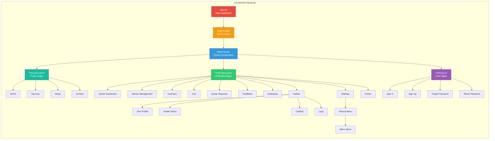
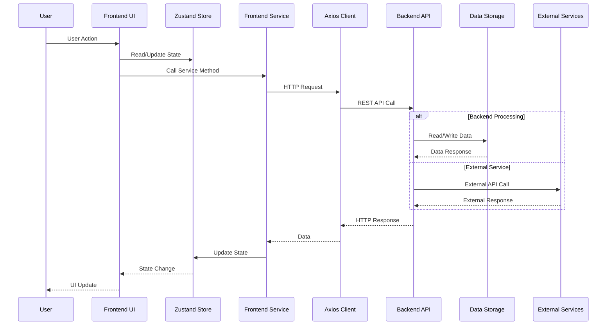
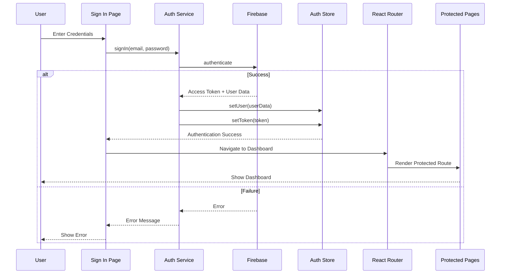
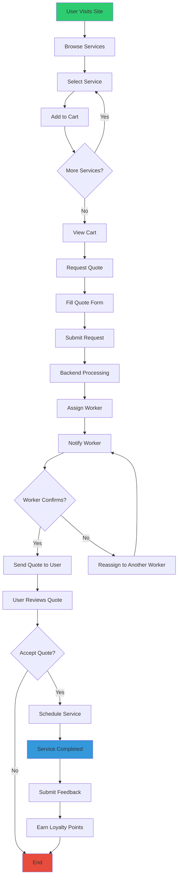
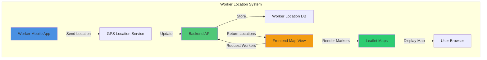
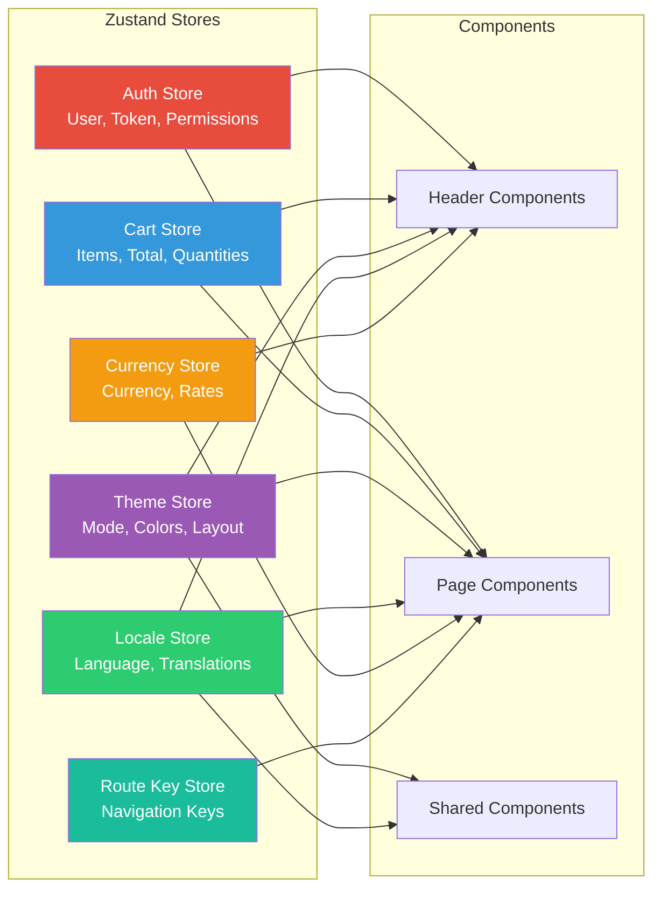
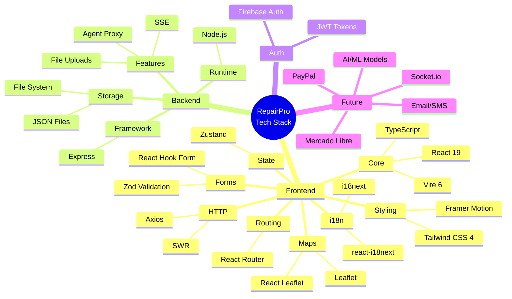

# RepairPro - System Architecture Diagram

This file contains the complete sytem architecture diagram in Mermaid format.

## Complete System Architecture

```mermaid
graph TB
    subgraph "Client Layer"
        Browser[Web Browser]
        Mobile[Mobile Browser]
    end
    
    subgraph "Frontend Application - React 19 + TypeScript + Vite"
        direction TB
        
        subgraph "Entry Point"
            Main[main.tsx]
            App[App.tsx]
        end
        
        subgraph "Views/Pages"
            Home[Home]
            Services[Services]
            About[About]
            Contact[Contact]
            Cart[Cart]
            Quote[Quote Requests]
            Workers[Worker Map]
            Inventory[Inventory]
            Feedback[Feedback]
            Admin[Admin Dashboard]
            Auth[Auth Views]
        end
        
        subgraph "Components"
            Layouts[Layouts]
            Shared[Shared Components]
            Template[Template]
            UI[UI Primitives]
        end
        
        subgraph "State Management - Zustand"
            AuthStore[Auth Store]
            CartStore[Cart Store]
            ThemeStore[Theme Store]
            LocaleStore[Locale Store]
            CurrencyStore[Currency Store]
        end
        
        subgraph "Services Layer"
            AuthService[Auth Service]
            APIService[API Service]
            WorkerService[Worker Service]
            AgentService[Agent Service]
            HealthService[Health Service]
        end
        
        subgraph "Core Systems"
            AuthSystem[Authentication]
            i18n[i18next]
            Router[React Router]
        end
        
        Main --> App
        App --> Router
        Router --> Views
        Views --> Layouts
        Layouts --> Shared
        Shared --> Template
        Template --> UI
        Views --> State Management
        Views --> Services Layer
        Services Layer --> Core Systems
    end
    
    subgraph "Backend Server - Node.js + Express"
        direction TB
        
        subgraph "Server"
            ExpressServer[Express Server<br/>Port 3001]
        end
        
        subgraph "API Routes"
            AgentRoute[/api/agent<br/>Secure Proxy]
            WorkersRoute[/api/workers<br/>Worker Management]
            InventoryRoute[/api/inventory<br/>Inventory CRUD]
            EventsRoute[/api/events<br/>SSE Events]
            UploadsRoute[/api/uploads<br/>File Uploads]
        end
        
        subgraph "Middleware"
            ValidateAgent[Validate Agent Request]
            CORS[CORS Handler]
            BodyParser[Body Parser]
        end
        
        subgraph "Utilities"
            AgentPolicy[Agent Policy]
            SafeFetch[Safe Fetch]
            SSE[SSE Utils]
            DB[Database Utils]
            InventoryService[Inventory Service]
        end
        
        subgraph "Data Storage"
            JSONData[inventory.json]
            FileSystem[File System]
        end
        
        ExpressServer --> Middleware
        Middleware --> API Routes
        API Routes --> Utilities
        Utilities --> Data Storage
    end
    
    subgraph "External Services"
        Firebase[Firebase Auth]
        LeafletMaps[Leaflet Maps]
        OpenAI[OpenAI API<br/>via Agent Proxy<br/>Secured with host allowlist]
    end
    
    subgraph "Future Integrations"
        PayPal[PayPal SDK]
        MercadoLibre[Mercado Libre API]
        EmailService[Email Notifications]
        SMSService[SMS Notifications]
        SocketIO[Socket.io<br/>Real-time Updates]
        AIModels[AI/ML Models]
    end
    
    Browser --> Main
    Mobile --> Main
    
    Services Layer -->|HTTP/REST| ExpressServer
    AuthSystem --> Firebase
    Workers --> LeafletMaps
    AgentRoute --> OpenAI
    
    ExpressServer -.->|Planned| PayPal
    ExpressServer -.->|Planned| MercadoLibre
    ExpressServer -.->|Planned| EmailService
    ExpressServer -.->|Planned| SMSService
    ExpressServer -.->|Planned| SocketIO
    ExpressServer -.->|Planned| AIModels
    
    style Browser fill:#e3f2fd
    style Mobile fill:#e3f2fd
    style Main fill:#ffecb3
    style ExpressServer fill:#c8e6c9
    style AuthSystem fill:#ffcdd2
    style State Management fill:#f3e5f5
    style Services Layer fill:#e1f5fe
    style API Routes fill:#c5e1a5
    style Firebase fill:#fff9c4
    style LeafletMaps fill:#b2dfdb
```

### External Services Details

#### OpenAI Integration (via Agent Proxy)
The application uses a secure Agent Proxy endpoint to communicate with OpenAI API:
- **Endpoint**: `/api/agent` (POST)
- **Security**: Host allowlist enforced (`api.openai.com`, `*.openai.azure.com`)
- **Features**: Supports both JSON responses and Server-Sent Events (SSE) streaming
- **Guardrails**: Request/response size limits, header sanitization, timeout protection
- **Authentication**: Authorization headers are redacted from logs for security
- **Use Case**: Powers the AI chatbot component for customer support

For more details on the Agent Proxy security features, see the backend README.

## Detailed Component Architecture



## Data Flow Architecture



## Authentication Flow



## Service Request Workflow



## Worker Location System



## State Management Flow



## API Architecture

```mermaid
graph TB
    subgraph "Frontend Services"
        AuthSvc[AuthService]
        APISvc[ApiService]
        WorkerSvc[WorkerService]
        AgentSvc[AgentService]
        HealthSvc[HealthService]
    end
    
    subgraph "HTTP Layer"
        AxiosBase[Axios Base Config]
        ReqInterceptor[Request Interceptor]
        ResInterceptor[Response Interceptor]
    end
    
    subgraph "Backend Routes"
        Agent[/api/agent]
        Workers[/api/workers]
        Inventory[/api/inventory]
        Events[/api/events]
        Uploads[/api/uploads]
    end
    
    subgraph "Backend Middleware"
        Validate[Validate Agent Request]
        CORSMid[CORS Middleware]
        BodyParser[Body Parser]
    end
    
    subgraph "Backend Utils"
        SafeFetch[Safe Fetch]
        AgentPolicy[Agent Policy]
        SSEUtils[SSE Utils]
        DBUtils[DB Utils]
        InvService[Inventory Service]
    end
    
    AuthSvc --> AxiosBase
    APISvc --> AxiosBase
    WorkerSvc --> AxiosBase
    AgentSvc --> AxiosBase
    HealthSvc --> AxiosBase
    
    AxiosBase --> ReqInterceptor
    ReqInterceptor --> ResInterceptor
    ResInterceptor --> Backend Routes
    
    Backend Routes --> Backend Middleware
    Backend Middleware --> Backend Utils
    
    style Frontend Services fill:#e1f5fe
    style HTTP Layer fill:#fff9c4
    style Backend Routes fill:#c5e1a5
    style Backend Middleware fill:#ffccbc
    style Backend Utils fill:#d1c4e9
```

## Technology Stack Overview


