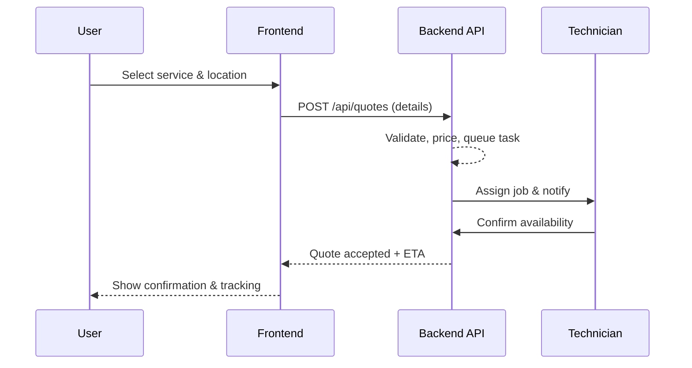
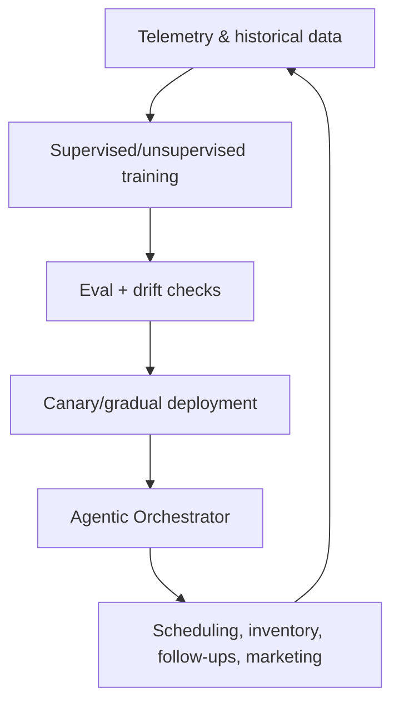

# RepairPro - Professional Repair Services Application


A comprehensive web application focused on repair services, installation, and parts supply for home, industrial, and commercial sectors.

## Author

- Marcos Mora — Full Stack Developer (IBM assessment)

## Features

### Service Categories

- ⚡ Electrical Fencing Installation
- 📹 Surveillance Camera Installation
- 🎨 Professional Painting Services
- ❄️ Air Conditioning Repairs & Installation
- 🔧 Preventive Maintenance Programs
- 🚨 Emergency Repair Services

### Customer Features

- 🛒 **Shopping Cart**: User-friendly cart to manage selected services
- 📝 **Quote System**: Request quotes with optional inspection scheduling
- 🗺️ **Worker Map**: Find available workers by zone with real-time location
- ⭐ **Feedback System**: Rate services and earn loyalty points
- 🎁 **Loyalty Program**: Discounts and coupons for repeat customers
- 💬 **Chatbot**: AI-powered customer support assistant

### Admin Features

- 📊 **Admin Dashboard**: Full management of services and requests
- 👷 **Worker Management**: Track workers, availability, and job status
- 📦 **Inventory System**: Track parts and supplies
- 📈 **Real-time Reports**: Job status and worker location tracking

### Technical Features

- 🌐 **Multilingual**: English and Spanish support
- 💱 **Multi-currency**: USD and EUR support
- 📱 **Responsive Design**: Works on all devices
- 🎨 **Modern UI**: Animated interfaces with dark mode support

## Tech Stack

- **Frontend**: React 19, TypeScript, Vite
- **Styling**: Tailwind CSS 4
- **State Management**: Zustand
- **Animations**: Framer Motion
- **Internationalization**: i18next
- **Maps**: Leaflet
- **Backend (Planned)**: Node.js, Express

## Prerequisites

- Node.js 18+
- npm or yarn

## Installation

```bash
# Install dependencies
npm install

# Start development server
npm run dev

# Build for production
npm run build

# Preview production build
npm run preview
```

## Project Structure

```text
src/
├── @types/           # TypeScript types
├── assets/           # Static assets and styles
├── auth/             # Authentication logic
├── components/       # React components
│   ├── layouts/      # Layout components
│   ├── shared/       # Shared components (Chatbot, etc.)
│   ├── template/     # Template components
│   └── ui/           # UI components
├── configs/          # App configuration
├── constants/        # Constants
├── data/             # Static data
├── locales/          # Translations
├── services/         # API services
├── store/            # Zustand stores
├── utils/            # Utility functions
└── views/            # Page components
    ├── about/        # About page
    ├── admin/        # Admin dashboard
    ├── cart/         # Shopping cart
    ├── contact/      # Contact page
    ├── enterprise/   # Enterprise features
    ├── feedback/     # Feedback & loyalty
    ├── inventory/    # Inventory management
    ├── quote/        # Quote request
    ├── services/     # Services catalog
    └── workers/      # Worker map
```

## Future Integrations

- 💳 PayPal SDK for payments
- 🛍️ Mercado Libre API
- 📧 Email notifications
- 📱 SMS notifications
- 🔄 Real-time updates with Socket.io

## Planned AI Enhancements

- 🤖 AI service routing: intelligent assignment of requests to the best technician based on skills, location, and availability.
- 🧠 Deep learning models: supervised and unsupervised training pipelines to improve predictions (eta, pricing, churn risk, demand forecasting).
- 🧭 Agentic automation: autonomous workflow agents to orchestrate inspections, scheduling, inventory checks, and follow-ups.
- 🚀 Production-ready MLOps: continuous retraining, evaluation, and rollout strategies with safeguards and canary releases.
- 📈 Smart marketing automation: audience scoring, personalized offers, and campaign sequencing driven by model insights.
- 🔐 Guardrails & governance: bias monitoring, drift detection, and human-in-the-loop review for critical decisions.

## Architecture & Workflows (visual)

### High-level component map

```mermaid
flowchart LR
    subgraph Frontend [Frontend (Vite + React 19 + TS)]
        UI[UI Components]
        State[Zustand Stores]
        I18n[i18next]
        Maps[Leaflet]
    end

    subgraph Backend [Backend (Node/Express planned)]
        API[REST API]
        Auth[Auth & Tokens]
        Services[Services/Quotes/Workers]
        Inventory[Inventory]
    end

    subgraph Integrations [Integrations]
        PayPal[PayPal SDK]
        Mercado[Mercado Libre]
        Notif[Email/SMS]
    end

    UI -->|Axios| API
    State --> UI
    I18n --> UI
    Maps --> UI
    API --> Services
    API --> Inventory
    API --> Auth
    API --> PayPal
    API --> Mercado
    API --> Notif
```

### Service request workflow (happy path)



### AI/agentic automation loop (planned)




> Tip: To replace this placeholder image, export your Mermaid diagram as SVG from <https://mermaid.live> and save it to `public/img/diagrams/architecture.svg`.

## License

Private - All rights reserved

## Copyright

© 2026 Marcos Mora. All rights reserved.
