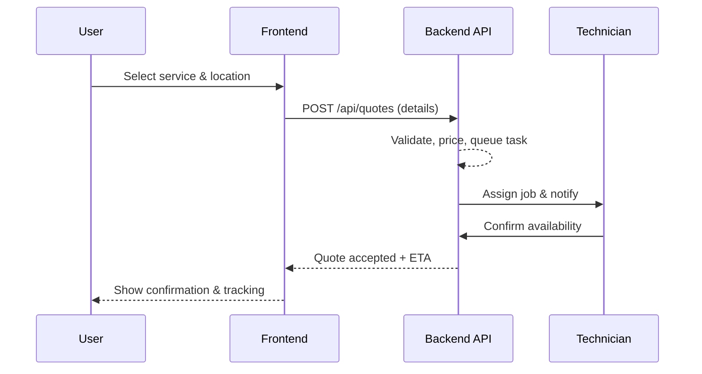
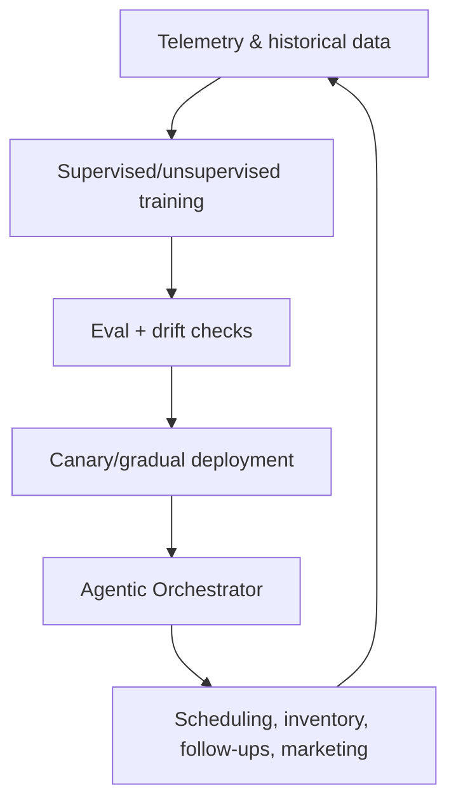

# servilogics app - Professional Repair Services Application


A comprehensive web application focused on repair services, installation, and parts supply for home, industrial, and commercial sectors.

## Author

- Marcos Mora — Full Stack Developer (IBM assessment)

## Features

### Service Categories

- ⚡ Electrical Fencing Installation
- 📹 Surveillance Camera Installation
- 🎨 Professional Painting Services
- ❄️ Air Conditioning Repairs & Installation
- 🔧 Preventive Maintenance Programs
- 🚨 Emergency Repair Services

### Customer Features

- 🛒 **Shopping Cart**: User-friendly cart to manage selected services
- 📝 **Quote System**: Request quotes with optional inspection scheduling
- 🗺️ **Worker Map**: Find available workers by zone with real-time location
- ⭐ **Feedback System**: Rate services and earn loyalty points
- 🎁 **Loyalty Program**: Discounts and coupons for repeat customers
- 💬 **Chatbot**: AI-powered customer support assistant

### Admin Features

- 📊 **Admin Dashboard**: Full management of services and requests
- 👷 **Worker Management**: Track workers, availability, and job status
- 📦 **Inventory System**: Track parts and supplies
- 📈 **Real-time Reports**: Job status and worker location tracking

### Technical Features

- 🌐 **Multilingual**: English and Spanish support
- 💱 **Multi-currency**: USD and EUR support
- 📱 **Responsive Design**: Works on all devices
- 🎨 **Modern UI**: Animated interfaces with dark mode support

## Tech Stack

- **Frontend**: React 19, TypeScript, Vite
- **Styling**: Tailwind CSS 4
- **State Management**: Zustand
- **Animations**: Framer Motion
- **Internationalization**: i18next
- **Maps**: Leaflet
- **Backend (Planned)**: Node.js, Express

## Agent Proxy (Safe Fetch + Streaming)

This project includes a secure Agent endpoint to safely proxy outbound HTTP requests from the frontend through the backend with strict guardrails and streaming support.

Endpoint

- POST /api/agent
- Modes: JSON (non-stream) and SSE (streaming, default)
- Default streaming uses Server‑Sent Events with a 15s heartbeat; NDJSON fallback is possible if an intermediary blocks SSE.

Environment variables (backend/.env)

- PORT: Backend port (default 3001)
- AGENT_HOST_ALLOWLIST: CSV of allowed hostnames, supports leading wildcard for Azure OpenAI (default: localhost, 127.0.0.1, api.openai.com, *.openai.azure.com)
- AGENT_TIMEOUT_MS: Upstream timeout (default 60000)
- AGENT_MAX_REQ_BODY: Max request body bytes (default 262144)
- AGENT_MAX_NONSTREAM_RESP: Max non‑stream response bytes (default 2097152)
- AGENT_SSE_HEARTBEAT_MS: SSE heartbeat interval ms (default 15000)

Guardrails & limits

- Host allowlist enforced; non‑allowlisted hosts are rejected
- Methods: GET, POST only; POST must be application/json
- Header allowlist: Accept, Content‑Type, Authorization; hop‑by‑hop headers stripped
- Request body cap: 256 KB; non‑stream response cap: 2 MB
- Timeout: 60 seconds; graceful error and stream close
- Secrets: Authorization redacted from logs and never echoed back

Dev proxy

- Vite dev proxy forwards /api → <http://localhost:3001> so the frontend can reach the backend Agent endpoint during development

Usage

- Non‑stream: POST JSON payload to /api/agent and receive a structured JSON response
- Stream: POST with Accept: text/event-stream to /api/agent and consume meta/chunk/done events; heartbeat comments are emitted roughly every 15 seconds

Troubleshooting

- SSE blocked by proxy: enable NDJSON fallback or use non‑stream mode
- 403 forbidden host: add hostname to AGENT_HOST_ALLOWLIST
- 413 payload too large: reduce input or increase AGENT_MAX_REQ_BODY cautiously
- 415 unsupported media type: use application/json for POST
- Timeout: reduce upstream work or increase AGENT_TIMEOUT_MS cautiously

## Prerequisites

- Node.js 18+
- npm or yarn
- Docker and Docker Compose (optional, for containerized deployment)

## Installation

### Standard Installation

```bash
# Install dependencies
npm install

# Start development server
npm run dev

# Build for production
npm run build

# Preview production build
npm run preview
```

### Docker Installation

For containerized deployment in GitHub Codespaces or Docker-enabled environments:

```bash
# Development mode (with hot reload)
npm run docker:dev

# Production mode
npm run docker:build
npm run docker:prod

# View logs
npm run docker:logs

# Stop containers
npm run docker:stop
```

**Quick Start**: See [DOCKER_QUICKSTART.md](DOCKER_QUICKSTART.md) for immediate Docker usage in Codespaces

**Complete Guide**: See [DOCKER_GUIDE.md](DOCKER_GUIDE.md) for comprehensive Docker setup and usage instructions

## Docker Backend Operations

### Architecture Overview

The Servilogics backend Docker image provides a fully containerised API layer that listens for calls and responses from the React frontend and the mobile application. The stack is orchestrated with Docker Compose and includes:

| Service | Image | Port | Purpose |
|---------|-------|------|---------|
| **mongodb** | `mongo:7` | 27017 | Primary database (non-relational event store + application data) |
| **backend** | `Dockerfile.backend` | 3001 | Express REST API + Socket.IO WebSocket server |
| **frontend** | `Dockerfile.frontend` | 80 | Nginx serving the Vite-built SPA with API/WebSocket reverse-proxy |

### Orchestration Plan

```
┌────────────────────────────────────────────────────────────┐
│  Docker Compose (docker-compose.yml / docker-compose.dev.yml)  │
│                                                            │
│  ┌──────────┐    ┌───────────┐    ┌───────────────┐       │
│  │ MongoDB  │◄───│  Backend  │◄───│   Frontend    │       │
│  │  :27017  │    │   :3001   │    │   :80/:5175   │       │
│  └──────────┘    │  REST API │    │   Nginx/Vite  │       │
│                  │  WebSocket│    │  Proxy /api/  │       │
│                  │  SSE      │    │  Proxy /socket│       │
│                  └───────────┘    └───────────────┘       │
│                        ▲                ▲                  │
│              ┌─────────┴────────────────┴──────────┐      │
│              │  Mobile App (local IP / localhost)   │      │
│              └─────────────────────────────────────┘      │
└────────────────────────────────────────────────────────────┘
```

### Step-by-Step Setup

#### 1. Environment Variables

Copy the example files and fill in your values:

```bash
# Root .env
cp .env.example .env

# Backend .env
cp backend/.env.example backend/.env
```

Key variables to configure:

| Variable | Default | Description |
|----------|---------|-------------|
| `PORT` | `3001` | Backend API port |
| `MONGODB_URI` | `mongodb://mongodb:27017` | MongoDB connection string (use Docker service name inside compose) |
| `MONGODB_DB_NAME` | `ecme_lite` | Database name |
| `CORS_ORIGIN` | `http://localhost:5173,...` | Allowed origins. **Add your local IP** (e.g. `http://192.168.1.100:5173`) for mobile access |
| `AGENT_HOST_ALLOWLIST` | `localhost,127.0.0.1,...` | Allowed proxy hosts |

#### 2. Development Mode

```bash
# Start all services (MongoDB + Backend + Frontend) with hot reload
npm run docker:dev

# Services available at:
#   Frontend: http://localhost:5175  (and http://<local-ip>:5175)
#   Backend:  http://localhost:3001  (and http://<local-ip>:3001)
#   MongoDB:  localhost:27017
```

#### 3. Production Mode

```bash
# Build optimised images
npm run docker:build

# Start production stack
npm run docker:prod

# Services available at:
#   Frontend: http://localhost       (port 80)
#   Backend:  http://localhost:3001
```

#### 4. Local IP / Mobile Access

All services bind to `0.0.0.0`, so they are reachable from any device on your LAN.
Find your local IP:

```bash
# macOS / Linux
ifconfig | grep "inet " | grep -v 127.0.0.1
# Windows
ipconfig | findstr IPv4
```

Then access the app on your phone at `http://<local-ip>:5175` (dev) or `http://<local-ip>` (prod).

Add your local IP to `CORS_ORIGIN` in `backend/.env` if you get CORS errors:

```env
CORS_ORIGIN=http://localhost:5173,http://192.168.1.100:5173,http://192.168.1.100:5175
```

### Database Architecture

The backend uses a **dual-database strategy**:

| Concern | Engine | Collection examples | Purpose |
|---------|--------|---------------------|---------|
| Application data (relational-like) | MongoDB | `users`, `workers`, `clients`, `jobs`, `quotes`, `services`, `settings` | Structured CRUD for business entities |
| Event collection (non-relational) | MongoDB | `agent_events` | Append-only event log for AI learning, auditing, and analytics |

**Why MongoDB for both?** MongoDB 7 offers ACID transactions, rich query operators, and native geolocation via `2dsphere` indexes — providing relational-level consistency while being ideal for event streams. For production at scale, consider migrating relational data to **AWS RDS (PostgreSQL)** using the free tier (750 h/month of `db.t3.micro`) and keeping MongoDB for the event store.

**Geolocation** is enabled via `2dsphere` indexes on:
- `workers.currentLocation.coordinates` — for proximity-based worker assignment
- `clients.location` — for service-area queries
- `agent_events.location` — for geo-tagged event analytics

### API & Communication

#### RESTful Endpoints

| Method | Path | Description |
|--------|------|-------------|
| POST | `/api/sign-in` | User authentication |
| POST | `/api/sign-up` | User registration |
| GET | `/api/health` | Health check |
| GET/POST | `/api/workers` | Worker CRUD |
| POST | `/api/workers/:id/location` | Update worker geolocation |
| GET/POST | `/api/clients` | Client CRUD |
| GET/POST | `/api/services` | Services catalog |
| POST | `/api/agent` | AI agent proxy (SSE + JSON) |
| GET/POST | `/api/events` | Event ingestion and query |
| GET | `/api/events/stream` | SSE event stream |
| GET/PUT | `/api/settings/contact` | Admin contact settings |
| GET/POST | `/api/inventory` | Inventory management |

#### WebSocket Events (Socket.IO)

The backend exposes a Socket.IO server on the same port (`3001`). In production, the Nginx frontend proxies `/socket.io/` to the backend.

| Event | Direction | Payload | Purpose |
|-------|-----------|---------|---------|
| `worker:join` | Client → Server | `workerId` | Join a worker room |
| `worker:location` | Client → Server | `{ workerId, lat, lng }` | Push location update |
| `worker:location:update` | Server → All | `{ workerId, lat, lng, timestamp }` | Broadcast location |
| `job:update` | Client → Server | `{ jobId, status, ... }` | Report job status change |
| `job:status` | Server → All | `{ jobId, status, ... }` | Broadcast job update |

### Pushing to AWS ECR (Free Tier)

AWS Free Tier provides **500 MB/month of ECR storage** and **500 MB of data transfer**. This is enough to store both images.

#### Prerequisites

1. [Create an AWS Free Tier account](https://aws.amazon.com/free/)
2. Install the [AWS CLI](https://aws.amazon.com/cli/) and run `aws configure`
3. Ensure Docker Desktop is running

#### Push Images

```bash
# Set your AWS account ID (auto-detected if aws configure is set)
export AWS_ACCOUNT_ID=123456789012
export AWS_REGION=us-east-1   # optional, default us-east-1

# Build and push (creates ECR repos automatically)
npm run docker:aws:push

# Or push a specific version
./aws-ecr-push.sh v1.2.0
```

#### Pull Images on Another Machine

```bash
aws ecr get-login-password --region us-east-1 | \
  docker login --username AWS --password-stdin 123456789012.dkr.ecr.us-east-1.amazonaws.com

docker pull 123456789012.dkr.ecr.us-east-1.amazonaws.com/servilogics-backend:latest
docker pull 123456789012.dkr.ecr.us-east-1.amazonaws.com/servilogics-frontend:latest
```

### Testing Strategy

| Level | Tool | Command | What it covers |
|-------|------|---------|----------------|
| Unit / E2E | Node test runner + Supertest | `cd backend && npm test` | API routes, middleware, policy enforcement |
| Health check | Docker Compose | Automatic | Backend `/api/health`, Frontend `/health` |
| Integration | Docker Compose | `npm run docker:dev` then `curl localhost:3001/api/health` | Full stack connectivity |
| Container validation | `docker-validate.sh` | `npm run docker:validate` | Dockerfile syntax, permissions, compose config |

### Troubleshooting

| Symptom | Likely cause | Fix |
|---------|--------------|-----|
| `ECONNREFUSED` on backend | MongoDB not ready | Compose uses `depends_on: condition: service_healthy` — wait for health check |
| CORS error from mobile | Local IP not in `CORS_ORIGIN` | Add `http://<local-ip>:<port>` to `CORS_ORIGIN` in `backend/.env` |
| Frontend shows blank page | Vite build copies to wrong dir | Ensure `Dockerfile.frontend` copies from `/app/dist` |
| WebSocket won't connect in prod | Nginx not proxying `/socket.io/` | Check `Dockerfile.frontend` nginx config for the `/socket.io/` location block |
| Port already in use | Previous container still running | `npm run docker:stop` or `npm run docker:stop:dev` |
| MongoDB data lost on restart | Volume not persisted | Check `mongodb-data` / `mongodb-dev-data` volume in compose |

### Monitoring on AWS

- **CloudWatch Container Insights** — attach to ECS tasks for CPU/memory metrics
- **ECR Image Scanning** — enabled by default (`scanOnPush: true`) for vulnerability detection
- **CloudWatch Logs** — pipe `docker-compose logs` to CloudWatch using the `awslogs` log driver
- **AWS X-Ray** — instrument Express with `aws-xray-sdk-express` for request tracing

## Project Structure

```text
src/
├── @types/           # TypeScript types
├── assets/           # Static assets and styles
├── auth/             # Authentication logic
├── components/       # React components
│   ├── layouts/      # Layout components
│   ├── shared/       # Shared components (Chatbot, etc.)
│   ├── template/     # Template components
│   └── ui/           # UI components
├── configs/          # App configuration
├── constants/        # Constants
├── data/             # Static data
├── locales/          # Translations
├── services/         # API services
├── store/            # Zustand stores
├── utils/            # Utility functions
└── views/            # Page components
    ├── about/        # About page
    ├── admin/        # Admin dashboard
    ├── cart/         # Shopping cart
    ├── contact/      # Contact page
    ├── enterprise/   # Enterprise features
    ├── feedback/     # Feedback & loyalty
    ├── inventory/    # Inventory management
    ├── quote/        # Quote request
    ├── services/     # Services catalog
    └── workers/      # Worker map
```

## Future Integrations

- 💳 PayPal SDK for payments
- 🛍️ Mercado Libre API
- 📧 Email notifications
- 📱 SMS notifications
- 🔄 Real-time updates with Socket.io

## Planned AI Enhancements

- 🤖 AI service routing: intelligent assignment of requests to the best technician based on skills, location, and availability.
- 🧠 Deep learning models: supervised and unsupervised training pipelines to improve predictions (eta, pricing, churn risk, demand forecasting).
- 🧭 Agentic automation: autonomous workflow agents to orchestrate inspections, scheduling, inventory checks, and follow-ups.
- 🚀 Production-ready MLOps: continuous retraining, evaluation, and rollout strategies with safeguards and canary releases.
- 📈 Smart marketing automation: audience scoring, personalized offers, and campaign sequencing driven by model insights.
- 🔐 Guardrails & governance: bias monitoring, drift detection, and human-in-the-loop review for critical decisions.

## Architecture & Workflows (visual)

### High-level component map

```mermaid
flowchart LR
    subgraph Frontend [Frontend (Vite + React 19 + TS)]
        UI[UI Components]
        State[Zustand Stores]
        I18n[i18next]
        Maps[Leaflet]
    end

    subgraph Backend [Backend (Node/Express planned)]
        API[REST API]
        Auth[Auth & Tokens]
        Services[Services/Quotes/Workers]
        Inventory[Inventory]
    end

    subgraph Integrations [Integrations]
        PayPal[PayPal SDK]
        Mercado[Mercado Libre]
        Notif[Email/SMS]
    end

    UI -->|Axios| API
    State --> UI
    I18n --> UI
    Maps --> UI
    API --> Services
    API --> Inventory
    API --> Auth
    API --> PayPal
    API --> Mercado
    API --> Notif
```

### Service request workflow (happy path)



### AI/agentic automation loop (planned)




> Tip: To replace this placeholder image, export your Mermaid diagram as SVG from <https://mermaid.live> and save it to `public/img/diagrams/architecture.svg`.

## 📚 Comprehensive Documentation

For detailed project structure and architecture information, see:

- **[PROJECT_STRUCTURE.md](PROJECT_STRUCTURE.md)** - Complete directory structure, component hierarchy, data flow diagrams, and detailed documentation of all modules
- **[STRUCTURE_QUICK_REFERENCE.md](STRUCTURE_QUICK_REFERENCE.md)** - Quick reference guide with directory tree, key components map, technology overview, and API endpoints

These documents provide a comprehensive view of the entire project structure, making it easy to:

- 🔍 Navigate the codebase
- 🏗️ Understand the architecture
- 📊 View component relationships
- 🔄 Follow data flows
- 🛣️ Understand routing and state management
- 🔌 Reference API endpoints

## License

Private - All rights reserved

## Copyright

© 2026 Marcos Mora. All rights reserved.
